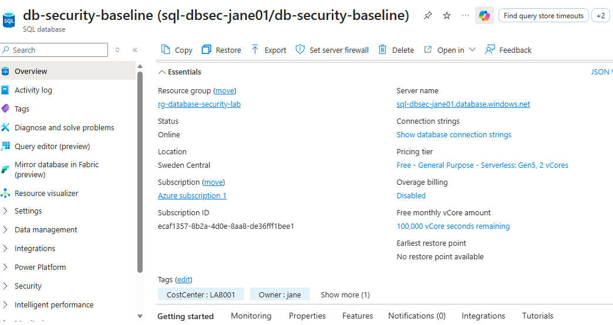
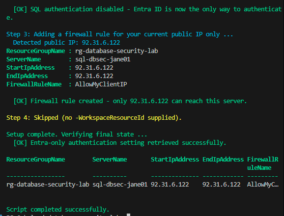
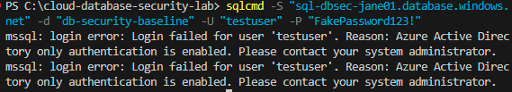
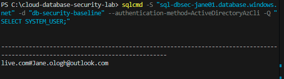
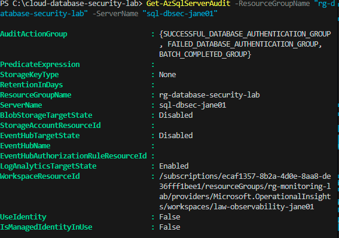

# Azure SQL Database Security Baseline

**Microsoft Entra-only authentication, network-restricted access, and audit logging wired into a centralised observability workspace - built entirely on Azure SQL Database's permanent free offer.**

Nine earlier projects in this portfolio cover identity, cost governance, storage, data pipelines, backup and recovery, security posture, observability, CI/CD, and networking - but none touch an actual relational database, a genuine gap for most cloud and platform engineer roles. This project closes it, and does so with a security posture that goes further than most database tutorials attempt: not just enabling Microsoft Entra authentication, but disabling SQL authentication entirely, removing an entire credential class from the attack surface rather than merely adding a stronger option alongside a weaker one.

## Why This Project Matters

A relational database is one of the most common resources an attacker targets, and one of the most common places weak authentication quietly persists - SQL logins created once, forgotten, never rotated, sitting alongside proper identity governance everywhere else in an environment. This project demonstrates the alternative: a database where SQL authentication cannot succeed under any circumstance, network access is restricted by default, and every login attempt is auditable in the same place every other resource in this portfolio is monitored.

## Why the Free Offer Is Safe to Build On

Azure SQL Database's free offer, generally available since 2025, provides up to 10 serverless databases per subscription, each with 100,000 vCore-seconds of compute and 32GB of storage free every month, for the lifetime of the subscription - not a 12-month or 30-day trial. This offer works regardless of subscription type, including Free Trial subscriptions specifically, and draws from a completely separate quota and billing pool than the VM-based compute that blocked three earlier attempts in this portfolio (Function Apps, AKS, Databricks). This distinction was verified directly against Microsoft's documentation before committing to the build, given this portfolio's history with services that looked free but weren't reliably so.

## Security Baseline

| Control | Configuration | Why It Matters |
|---|---|---|
| Authentication | Microsoft Entra ID only - SQL authentication disabled entirely | Removes an entire credential class from the attack surface, not just a weaker option left available alongside a stronger one |
| Network access | Firewall rule restricted to a single known client IP | Denies connections from anywhere else by default, rather than relying on authentication alone |
| Auditing | Enabled, sent to this portfolio's shared Log Analytics workspace | Every login attempt becomes queryable alongside every other resource's logs, not isolated in its own silo |
| Encryption at rest | Transparent Data Encryption, enabled by default | Confirmed directly rather than assumed |

## What's Included

| File | Purpose |
|---|---|
| `scripts/configure-security.ps1` | Configures the Entra admin, Entra-only authentication, and a restrictive firewall rule |
| `docs/architecture.md` | Full design rationale, including every genuine obstacle encountered and how each was resolved |
| `docs/architecture-diagram.md` | Visual diagram of the authentication and audit flow |
| `docs/setup-guide.md` | Complete reproduction steps with screenshot evidence points |
| `docs/screenshots/` | Evidence that Entra-only authentication genuinely rejects SQL logins and accepts Entra ID |

## Cost

- The database itself: free, permanently, within the monthly 100,000 vCore-second and 32GB allowance
- Entra-only authentication, firewall rules, and Transparent Data Encryption: configuration only, no additional cost
- Auditing to Log Analytics: covered by the same always-free monthly ingestion grant used throughout this portfolio

## Skills Demonstrated

**Database security hardening** - Entra-only authentication as a deliberate architectural choice to eliminate an entire credential class, not simply a preference for one authentication method over another.

**Network-restricted PaaS access** - firewall rules scoped to a single known source, denying by default rather than allowing broadly and filtering afterward.

**Audit logging integration** - connecting a new resource type into an existing, centralised observability workspace, extending a design built in an earlier project rather than standing up isolated logging infrastructure.

**Free-tier service evaluation** - verifying the difference between a permanent free offer and a time-boxed trial against official documentation before committing a build to it, a discipline earned directly from this portfolio's earlier encounters with services that looked free but weren't.

**Azure Policy governance in practice** - encountering a mandatory tag-enforcement policy blocking a legitimate operation, and resolving it correctly through a scoped, documented exemption rather than disabling the policy or working around it silently.

**Cross-tool authentication troubleshooting** - diagnosing a tenant-routing failure specific to guest identities in interactive browser authentication, and resolving it by switching to Azure CLI authentication with an explicit tenant context.

**PowerShell module version diagnosis** - identifying a genuine parameter-serialization bug in a specific `Az.Resources` module version by cross-checking the identical operation through Azure CLI, isolating the fault to the tool rather than the underlying Azure API.

**Honest technical documentation** - recording an unresolved limitation (live audit-query verification) as plainly as every successful outcome, rather than implying full success where only partial success was achieved.

## Screenshots

Evidence of the free database, the security configuration, and the authentication tests actually working, captured against a live Azure subscription during this build.

**1. Free Database Created**

The SQL database shown Online, with the free offer confirmed directly on the Overview page - Free General Purpose Serverless tier, and the full 100,000 vCore-seconds remaining for the month.

**2. Security Baseline Configured**

The Entra admin set, Entra-only authentication confirmed enabled, and a firewall rule scoped to exactly one known IP address - all verified in a single script run.

**3. SQL Authentication Rejected**

A connection attempt using a fabricated SQL username and password, rejected with the precise reason stated directly by the server: Azure Active Directory only authentication is enabled. An explicit structural rejection, not a generic failure.

**4. Entra Authentication Succeeds**

The same server, connected successfully via Microsoft Entra ID, after working through a genuine tenant-routing issue affecting a guest account and landing on Azure CLI authentication as the reliable path.

**5. Audit Configuration Confirmed**

Audit logging enabled and correctly pointed at the shared observability workspace, reached only after diagnosing a tag-policy conflict across three different tools and resolving it with a targeted Azure CLI policy exemption.

## Setup Guide

Full reproduction steps: `docs/setup-guide.md`.

## Conclusion

This project set out to close a specific, real gap in this portfolio, and does so with a security posture more thorough than most database tutorials attempt - disabling SQL authentication entirely rather than simply preferring Entra ID, proven by a genuine rejected login sitting directly alongside a genuine accepted one.

The build also produced this portfolio's most involved troubleshooting arc: a guest identity routed to the wrong tenant during interactive authentication, a modern command-line tool with an unfamiliar flag set, a tag-enforcement policy catching its fifth distinct resource type across this portfolio, and a genuine bug in a specific PowerShell module version that Azure CLI did not share. Each was diagnosed on its own terms rather than worked around blindly, and each is documented in full in `docs/architecture.md`.

Not every thread was tied off. Live query verification of audit data in the shared workspace was not achieved, despite confirmed-correct configuration, and that limitation is stated as plainly as every success. A portfolio built entirely from clean successes would be a less honest, and less useful, one than this.

Ten projects, one throughline: real Azure resources, built on genuinely free-tier services, with the actual obstacles encountered documented rather than edited out.

## Author

Jane - Cloud & Infrastructure Engineer, AZ-104 candidate.
The tenth and final project in a broader Azure governance and security portfolio, integrating directly with the identity governance and observability capstone projects.