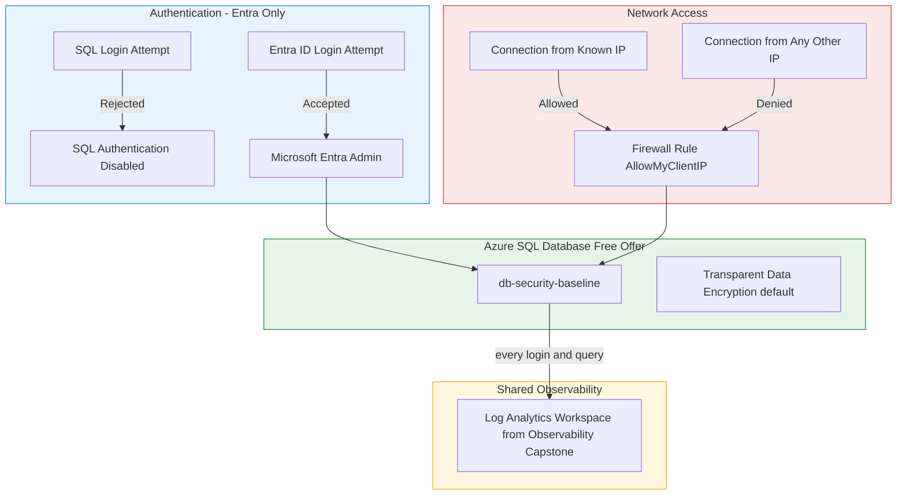

# Architecture Diagram

## Reading This Diagram

Authentication (top, blue): SQL logins are rejected unconditionally. Only Entra ID identities can reach the database.

Network (middle, red): a firewall rule permitting exactly one known IP, denying everything else by default.

Database (bottom-left, green): the free-offer serverless database itself, with Transparent Data Encryption active by default.

Audit (bottom-right, amber): every login attempt and query flows into the same shared Log Analytics workspace the observability capstone built.